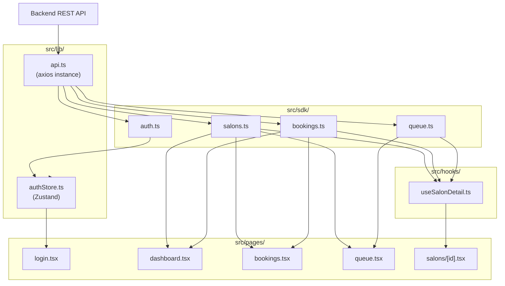
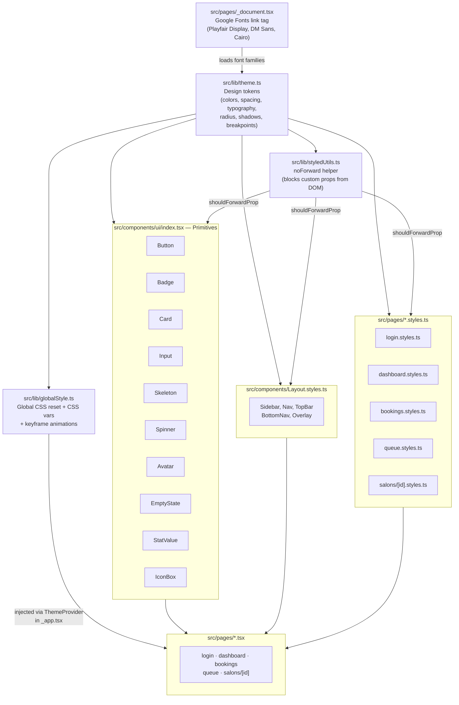
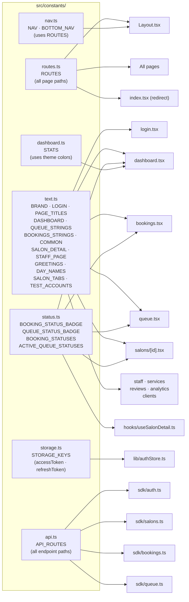

# Barber Dashboard

Salon management dashboard built with Next.js, styled-components, and Zustand.

---

## Data Flow



---

## Styling Architecture



---

## Constants Flow



---

## Project Structure

```
src/
├── constants/
│   ├── index.ts          barrel export
│   ├── routes.ts         page route paths
│   ├── text.ts           all UI strings & labels
│   ├── nav.ts            sidebar & bottom nav arrays
│   ├── status.ts         badge maps & status filter lists
│   ├── storage.ts        localStorage key names
│   ├── api.ts            API endpoint paths
│   └── dashboard.ts      stat card definitions (uses theme)
│
├── lib/
│   ├── api.ts            axios instance (base URL + auth header)
│   ├── authStore.ts      Zustand auth state (login/logout/hydrate)
│   ├── globalStyle.ts    CSS reset + custom properties + keyframes
│   ├── styledUtils.ts    noForward() — blocks custom props from DOM
│   ├── theme.ts          design tokens (colors, spacing, typography…)
│   └── types.ts          shared TypeScript types
│
├── sdk/
│   ├── index.ts          barrel export
│   ├── auth.ts           login · logout · me
│   ├── salons.ts         list · getById · getQueue
│   ├── bookings.ts       list · complete · cancel
│   └── queue.ts          callNext · serve · done · leave
│
├── hooks/
│   └── useSalonDetail.ts fetches salon + bookings + live queue
│
├── components/
│   ├── Layout.tsx         sidebar · topbar · bottom nav · auth guard
│   ├── Layout.styles.ts   styled-components for layout shell
│   └── ui/
│       └── index.tsx      Button · Badge · Card · Input · Skeleton
│                          Spinner · Avatar · EmptyState · IconBox…
│
└── pages/
    ├── _app.tsx            ThemeProvider + GlobalStyle
    ├── _document.tsx       font <link> + SSR style sheet
    ├── index.tsx           redirects → /dashboard
    ├── login.tsx
    ├── dashboard.tsx
    ├── bookings.tsx
    ├── queue.tsx
    ├── staff.tsx
    ├── services.tsx
    ├── reviews.tsx
    ├── analytics.tsx
    ├── clients.tsx
    └── salons/
        └── [id].tsx        overview · services · staff · bookings · queue tabs
```

---

## Tech Stack

| Layer | Library |
|---|---|
| Framework | Next.js 14 (Pages Router) |
| Styling | styled-components 6 |
| State | Zustand 4 |
| HTTP | Axios |
| Language | TypeScript (strict) |
| Fonts | Playfair Display · DM Sans · Cairo |
